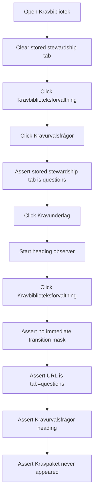

# Stewardship Navigation Integration Tests

> Test flow documentation for
> [`stewardship-navigation.spec.ts`](./stewardship-navigation.spec.ts)

This suite verifies that the global `Kravbiblioteksförvaltning` navigation
parent returns directly to the last-used stewardship tab. It protects the
question-tab path from briefly rendering `Kravpaket` before
`Kravurvalsfrågor`, and confirms that `Normbibliotek` is available as a
stewardship tab.

## Overview Flowchart

## Test Setup

- The scenario runs at desktop size (`1280x720`) because the reported behavior
  happens through the desktop parent navigation button.
- The standard Playwright global setup provides an authenticated admin session.
- A short browser-side heading observer records visible `h1` text during the
  return navigation so transient package-view renders are caught.
- The return click also checks that the delayed transition mask is not shown
  immediately for a normal fast route change.

## returns directly to the remembered question tab from specifications

### Purpose

Confirms that after visiting `Kravurvalsfrågor`, leaving for `Kravunderlag`,
and clicking `Kravbiblioteksförvaltning`, the app returns directly to
`Kravurvalsfrågor` without briefly showing `Kravpaket`.

### Step-by-Step Flow

1. Navigate to `/sv/requirements`.
1. Clear the stored stewardship tab.
1. Click `Kravbiblioteksförvaltning`.
1. Click `Kravurvalsfrågor`.
1. Assert the page heading is `Kravurvalsfrågor`.
1. Assert local storage records `requirements.stewardship.tab = questions`.
1. Click `Kravunderlag`.
1. Assert the page heading is `Kravunderlag`.
1. Start a heading observer.
1. Click `Kravbiblioteksförvaltning`.
1. Assert no immediate transition mask is shown.
1. Assert the URL contains `tab=questions`.
1. Assert the page heading is `Kravurvalsfrågor`.
1. Assert the recorded headings do not include `Kravpaket`.

## opens the norm library stewardship tab

### Norm Library Purpose

Confirms that `Normbibliotek` is reachable from `Kravbiblioteksförvaltning` and
persists as the remembered stewardship tab.

### Norm Library Step-by-Step Flow

1. Navigate to `/sv/requirements`.
1. Clear the stored stewardship tab.
1. Click `Kravbiblioteksförvaltning`.
1. Click `Normbibliotek`.
1. Assert the URL contains `tab=norms`.
1. Assert the page heading is `Normbibliotek`.
1. Assert local storage records `requirements.stewardship.tab = norms`.
