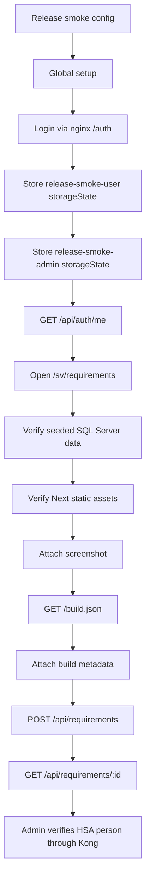
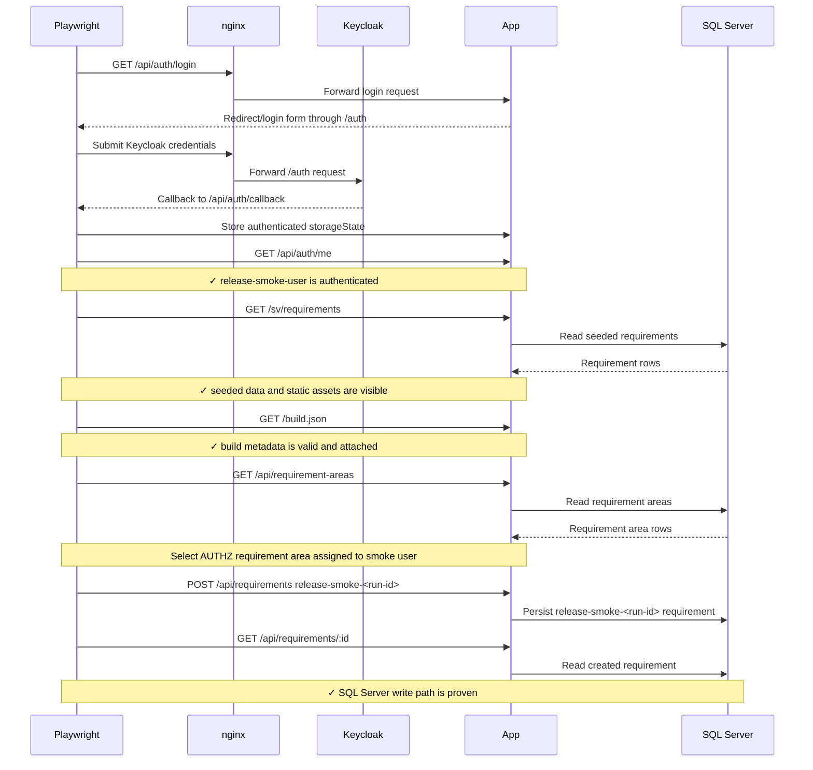
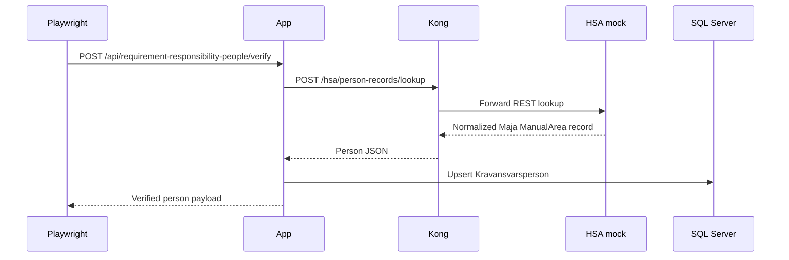

# Release Smoke Container Flow Tests

> Test flow documentation for [`release-smoke.spec.ts`](release-smoke.spec.ts)

This suite is the narrow Playwright proof for the container stack. It runs
against `https://kravhantering.test` after the Podman Compose stack is already
started, signs in through Keycloak via nginx, and verifies the release-critical
path without duplicating the full integration suite.

## Data Model

<!-- markdownlint-disable MD013 -->
| Property | Source | Purpose |
| --- | --- | --- |
| `storageState` | `tests/release-smoke/global-setup.ts` | Reuses the `release-smoke-user` and `release-smoke-admin` browser sessions. |
| `RELEASE_SMOKE_RUN_ID` | Environment | Optional stable prefix for created smoke requirements. |
| `build.json` | `/build.json` | Public build metadata embedded in the app image. |
| HSA fixture | `containers/hsa-directory-mock/fixtures/hsa-personer.json` | Provides deterministic person data through Kong. |
| `AUTHZ` requirement area | `typeorm/seed.mjs` | Gives the no-role smoke user a deterministic kravområdesmedförfattare assignment for the write proof. |
<!-- markdownlint-enable MD013 -->

Example build metadata shape:

```json
{
  "version": "0.1.0",
  "commitSha": "abc123",
  "builtAt": "2026-05-22T12:00:00.000Z",
  "imageTag": "localhost/kravhantering/app-runtime:local"
}
```

## Overview Flowchart



## Test Setup

- `playwright.release-smoke.config.ts` points at
  `https://kravhantering.test`, writes output to `test-results/release-smoke`,
  and does not start a web server.
- The runner must trust `tmp/container-tls/ca.crt` for both Node and Chromium
  so the suite uses regular HTTPS verification. In the devcontainer,
  `npm run container:release-smoke:up` runs
  `.devcontainer/trust-container-ca.sh` after generating the CA.
- `global-setup.ts` signs in as `release-smoke-user` and
  `release-smoke-admin` with the committed non-production passwords from the
  container Keycloak realm.
- `container:release-smoke:up` starts Kong and the HSA directory mock for the
  release-smoke stack. The app runtime receives
  `HSA_PERSON_LOOKUP_URL=http://kong:8000/hsa/person-records/lookup`.
- The config adds same-origin and `X-Requested-With` headers so API mutations
  exercise the same CSRF path as the browser UI.

## proves HTTPS, auth, SQL Server reads and writes, assets, and build metadata

### Browser Purpose

This test verifies that the externally visible container route can serve the
app over HTTPS, authenticate through Keycloak, read seeded SQL Server data,
serve static image contents, expose build metadata, and persist one small
CSRF-protected requirement mutation.

### Browser Flow

1. Request `/api/auth/me` with the stored session and verify
   `release-smoke-user` is authenticated with the expected HSA-id.
2. Open `/sv/requirements` and wait for the app to fetch
   `/api/requirements`.
3. Assert at least one seeded requirement is returned and visible in the page.
4. Assert at least one `/_next/static/` resource loaded with HTTP 200.
5. Attach a full-page screenshot as release smoke evidence.
6. Request `/build.json`, validate all metadata fields, and attach the JSON.
7. Request `/api/requirement-areas` and choose the seeded `AUTHZ` requirement
   area assigned to the smoke user.
8. POST `/api/requirements` with a description beginning
   `release-smoke-<run-id>`.
9. GET the created requirement by id and verify it matches the POST result.

### Browser Sequence Diagram



## verifies HSA person lookup through Kong and the HSA mock

### HSA Purpose

This test proves that the release-smoke stack contains the locked test support
path for HSA verification. It uses the admin session because verifying a new
kravområdesägare requires the `Admin` role.

### HSA Flow

1. Create an API request context with the stored `release-smoke-admin`
   `storageState`.
2. POST `/api/requirement-responsibility-people/verify` with
   `mode=refresh`, `purpose=requirement_area_owner` and
   `SE5560000001-manualarea1`.
3. Verify that the response contains normalized person data for Maja
   ManualArea from the HSA mock fixture.

### HSA Sequence Diagram


