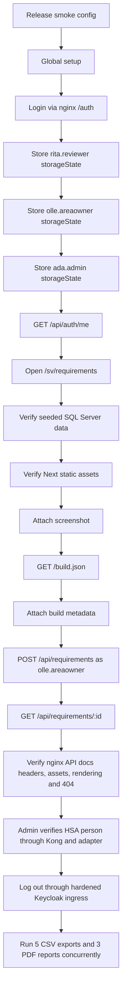
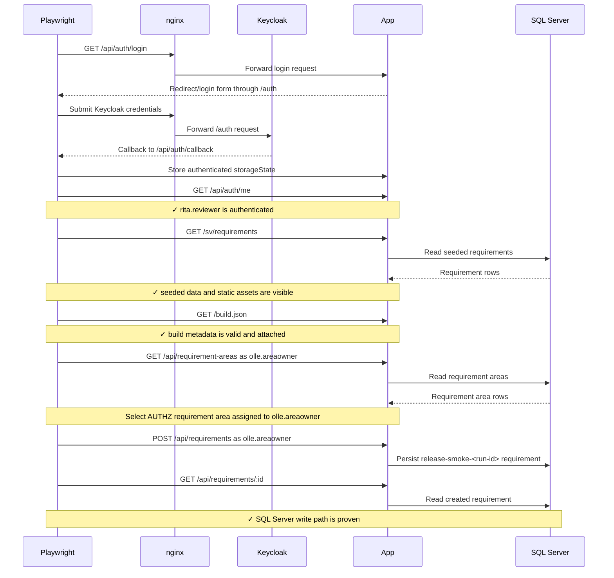
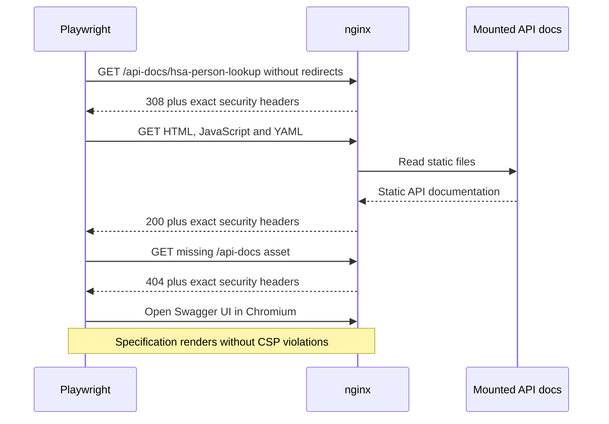
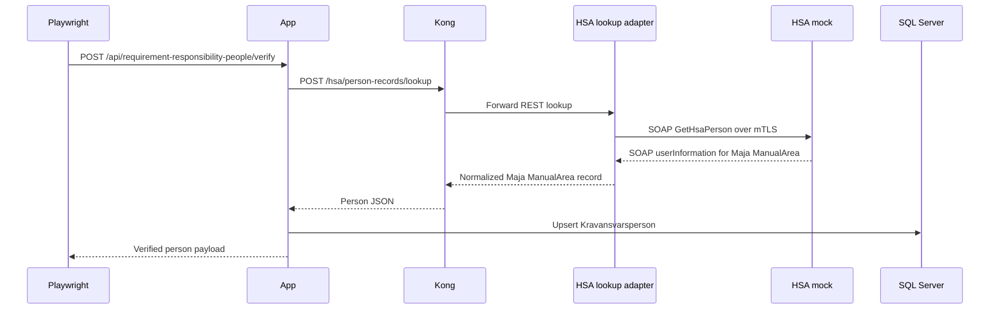

# Release Smoke Container Flow Tests

> Test flow documentation for [`release-smoke.spec.ts`](release-smoke.spec.ts)

This suite is the narrow Playwright proof for the installed production archive.
It runs against `https://kravhantering.test` after the real rootless Quadlet
topology and its CI-only HSA overlay are started, signs in through Keycloak via
nginx, and verifies the release-critical path, including nginx-served API
documentation, without duplicating the full integration suite.

The production smoke runs the first authenticated test once with the default
`bundled` profile to prove its unchanged browser login. It then switches the
installed topology to `hardened-bundled`, verifies the ingress boundary, and
runs the complete suite so login and logout also traverse the hardened
user-facing allow-list.

## Data Model

<!-- markdownlint-disable MD013 -->
| Property | Source | Purpose |
| --- | --- | --- |
| `storageState` | `tests/release-smoke/global-setup.ts` | Global setup generates the `rita.reviewer`, `olle.areaowner`, and `ada.admin` browser sessions under `test-results/release-smoke/auth/`. |
| `RELEASE_SMOKE_RUN_ID` | Environment | Optional stable prefix for created smoke requirements. |
| `build.json` | `/build.json` | Public build metadata embedded in the app image. |
| API docs | `public/api-docs/` | Static Swagger UI mounted directly into nginx. |
| HSA fixture | `containers/hsa-directory-mock/fixtures/hsa-personer.json` | Provides deterministic person data through Kong and the adapter. |
| `AUTHZ` requirement area | `typeorm/seed.mjs` | Gives `olle.areaowner` a deterministic owner assignment for the write proof. |
<!-- markdownlint-enable MD013 -->

Example build metadata shape:

```json
{
  "version": "0.1.0",
  "commitSha": "abc123",
  "expectedDatabaseSchemaVersion": "InitialSqlServerSchema1713720000000",
  "builtAt": "2026-05-22T12:00:00.000Z",
  "imageTag": "localhost/kravhantering/app-runtime:local"
}
```

## Overview Flowchart


```mermaid
flowchart TD
    A[Release smoke config] --> B[Global setup]
    B --> C[Login via nginx /auth]
    C --> D[Store rita.reviewer storageState]
    D --> E[Store olle.areaowner storageState]
    E --> F[Store ada.admin storageState]
    F --> G[GET /api/auth/me]
    G --> H[Open /sv/requirements]
    H --> I[Verify seeded SQL Server data]
    I --> J[Verify Next static assets]
    J --> K[Attach screenshot]
    K --> L[GET /build.json]
    L --> M[Attach build metadata]
    M --> N[POST /api/requirements as olle.areaowner]
    N --> O[GET /api/requirements/:id]
    O --> P[Verify nginx API docs headers, assets, rendering and 404]
    P --> Q[Admin verifies HSA person through Kong and adapter]
    Q --> R[Log out through hardened Keycloak ingress]
    R --> S[Run 5 CSV exports and 3 PDF reports concurrently]
```

## Test Setup

- `playwright.release-smoke.config.ts` points at
  `https://kravhantering.test`, writes output to `test-results/release-smoke`,
  and does not start a web server.
- The runner trusts `tmp/container-tls/ca.crt` for both Node and Chromium so
  the suite uses regular HTTPS verification.
- `global-setup.ts` signs in as `rita.reviewer`, `olle.areaowner`, and
  `ada.admin` with the committed non-production passwords merged into the
  production realm.
- The CI-only Quadlet overlay starts Kong, the HSA person lookup adapter and
  the HSA directory mock. The app runtime receives
  `HSA_PERSON_LOOKUP_URL=https://kong:8443/hsa/person-records/lookup`; Kong's
  CI-only certificate is issued by the same disposable CA trusted by the app.
- The config adds same-origin and `X-Requested-With` headers so API mutations
  exercise the same CSRF path as the browser UI.

## proves HTTPS, auth, SQL Server reads and writes, assets, and build metadata

### Browser Purpose

This test verifies that the externally visible container route can serve the
app over HTTPS, authenticate through Keycloak, read seeded SQL Server data,
serve static image contents, expose build metadata, and persist one small
CSRF-protected requirement mutation.

### Browser Flow

1. Request `/api/auth/me` with the stored session and verify
   `rita.reviewer` is authenticated with the expected HSA-id.
2. Open `/sv/requirements` and wait for the app to fetch
   `/api/requirements`.
3. Assert at least one seeded requirement is returned and visible in the page.
4. Assert at least one `/_next/static/` resource loaded with HTTP 200.
5. Attach a full-page screenshot as release smoke evidence.
6. Request `/build.json`, validate all metadata fields including the expected
   database schema version, and attach the JSON.
7. Use the `olle.areaowner` session to request `/api/requirement-areas` and
   choose the seeded `AUTHZ` requirement area assigned to that user.
8. POST `/api/requirements` with a description beginning
   `release-smoke-<run-id>`.
9. GET the created requirement by id and verify it matches the POST result.

### Browser Sequence Diagram


```mermaid
sequenceDiagram
    participant PW as Playwright
    participant N as nginx
    participant KC as Keycloak
    participant APP as App
    participant DB as SQL Server

    PW->>N: GET /api/auth/login
    N->>APP: Forward login request
    APP-->>PW: Redirect/login form through /auth
    PW->>N: Submit Keycloak credentials
    N->>KC: Forward /auth request
    KC-->>PW: Callback to /api/auth/callback
    PW->>APP: Store authenticated storageState
    PW->>APP: GET /api/auth/me
    Note over PW,APP: ✓ rita.reviewer is authenticated
    PW->>APP: GET /sv/requirements
    APP->>DB: Read seeded requirements
    DB-->>APP: Requirement rows
    Note over PW,APP: ✓ seeded data and static assets are visible
    PW->>APP: GET /build.json
    Note over PW,APP: ✓ build metadata is valid and attached
    PW->>APP: GET /api/requirement-areas as olle.areaowner
    APP->>DB: Read requirement areas
    DB-->>APP: Requirement area rows
    Note over PW,APP: Select AUTHZ requirement area assigned to olle.areaowner
    PW->>APP: POST /api/requirements as olle.areaowner
    APP->>DB: Persist release-smoke-<run-id> requirement
    PW->>APP: GET /api/requirements/:id
    APP->>DB: Read created requirement
    Note over PW,DB: ✓ SQL Server write path is proven
```

## serves strict CSP-compatible API docs directly from nginx

### API Documentation Purpose

This test proves that the release-smoke nginx serves the static API
documentation itself, applies the application-defined security-header contract
to every documentation response, and renders Swagger without CSP violations.

### API Documentation Flow

1. Request `/api-docs/hsa-person-lookup` without following redirects and
   verify HTTP 308, the trailing-slash target, and exact security headers.
2. Request the HTML, external initializer JavaScript, and OpenAPI YAML.
3. Verify each successful response has the expected content type, content,
   and exactly one value for every required security header.
4. Request a missing path below `/api-docs/` and verify HTTP 404 with the same
   exact headers.
5. Open the Swagger UI in Chromium, verify the HSA person lookup title, and
   assert that the browser console contains no CSP violations.

### API Documentation Sequence Diagram


```mermaid
sequenceDiagram
    participant PW as Playwright
    participant N as nginx
    participant FS as Mounted API docs

    PW->>N: GET /api-docs/hsa-person-lookup without redirects
    N-->>PW: 308 plus exact security headers
    PW->>N: GET HTML, JavaScript and YAML
    N->>FS: Read static files
    FS-->>N: Static API documentation
    N-->>PW: 200 plus exact security headers
    PW->>N: GET missing /api-docs asset
    N-->>PW: 404 plus exact security headers
    PW->>N: Open Swagger UI in Chromium
    Note over PW,N: Specification renders without CSP violations
```

## preserves browser logout through the hardened Keycloak ingress

This test starts with the authenticated reviewer storage state, opens the
requirements library, and signs out through the account menu. It verifies that
the Keycloak end-session and browser authorization continuation paths remain
available through the hardened user-facing allow-list while administrative
paths remain denied by the production smoke shell checks.

The test confirms the browser returns to the production realm authorization
endpoint and `/api/auth/me` reports an unauthenticated session.

## verifies HSA person lookup through Kong, adapter and the HSA mock

### HSA Purpose

This test proves that the release-smoke stack contains the locked test support
path for HSA verification: Kong, `hsa-person-lookup-adapter`, and the HSA
directory mock. It uses the admin session because verifying a new
kravområdesägare requires the `Admin` role.

### HSA Flow

1. Create an API request context with the stored `ada.admin`
   `storageState`.
2. POST `/api/requirement-responsibility-people/verify` with
   `mode=refresh`, `purpose=requirement_area_owner` and
   `SE5560000001-manualarea1`.
3. Verify that the response contains normalized person data for Maja
   ManualArea from the HSA mock fixture.

### HSA Sequence Diagram


```mermaid
sequenceDiagram
    participant PW as Playwright
    participant APP as App
    participant K as Kong
    participant A as HSA lookup adapter
    participant HSA as HSA mock
    participant DB as SQL Server

    PW->>APP: POST /api/requirement-responsibility-people/verify
    APP->>K: POST /hsa/person-records/lookup
    K->>A: Forward REST lookup
    A->>HSA: SOAP GetHsaPerson over mTLS
    HSA-->>A: SOAP userInformation for Maja ManualArea
    A-->>K: Normalized Maja ManualArea record
    K-->>APP: Person JSON
    APP->>DB: Upsert Kravansvarsperson
    APP-->>PW: Verified person payload
```

## runs configured maximum generated-output concurrency

This test starts five authenticated action-log CSV exports and three
authenticated requirement-list PDF reports together, matching the configured
per-node concurrency maxima. Every response must complete with its expected
content type. The subsequent boundary harness confirms that the application
did not restart or record a cgroup OOM kill during this normal load.
